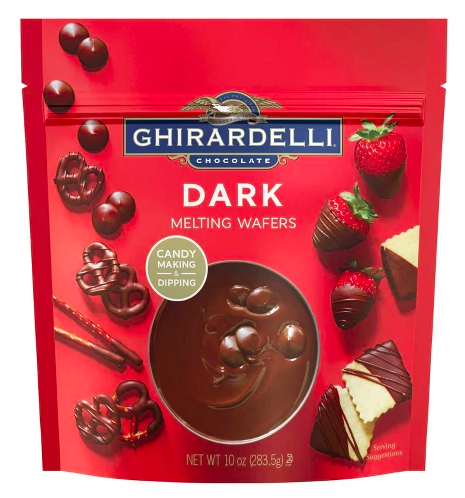
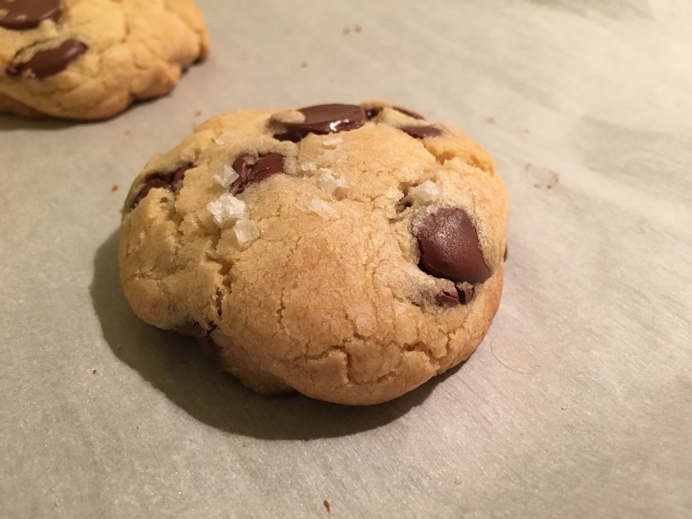

I'm a staunch believer in a somewhat famous New York Times recipe for chocolate chip cookies. Following the
[recipe][nyt-recipe] is fairly simple, but there are some specific tips I have after years of chasing the
perfect chocolate chip cookie. Combine the recipe with these tips and like me, you might be
able to convince your friends that you're a good baker.

## The Recipe

Ingredients:
  - 2 cups + 2tbsp. cake flour (8.5 oz.)
  - 1 2/3 cup bread flour (8.5 oz.)
  - 1 1/4 tsp. baking soda
  - 1 1/2 tsp. baking powder
  - 1 1/2 tsp. coarse salt
  - 2 1/2 sticks unsalted butter, melted
  - 1 1/4 cups light brown sugar (10 oz.)
  - 1 cup + 2 tbsp. granulated white sugar (8 oz.)
  - 2 eggs
  - 2 tsp. vanilla extract
  - 1 1/4 lbs chocolate disks
  - Sea salt

Instructions:
  - Sift flours, baking soda/powder and salt into bowl. Set aside.
  - Cream (melted) butter and sugars together until light (~5 min).
  - Add eggs, mixing in between.
  - Stir in vanilla
  - Mix in dry ingredients, then chocolate disks
  - Cling wrap dough and let chill in refrigerator overnight
  - Scoop into golf ball sized balls, roll top in sea salt.
  - Bake at 350F for ~15 min.

## Where you can cut corners...

Generally the recipe as it stands is pretty fussy. In my opinion, you can get by with only using one type
of flour (probably general purpose), instead of the two kinds called for in the original recipe. I also
think that the amount of sugar can be cut down on, and that you can use salted butter if it means not taking
an extra trip to the store. Of course, for best results you should try to follow the recipe closely if possible.

## ...and where you can't

The absolute most important element of this cookie is the kind of chocolate used. You want to get chocolate
disks which are usually used for melting and creating chocolate sauces. **Don't mess this up!** - using
chocolate chips just won't achieve the desired result. You're looking for the finished product to have little
pools of melted chocolate, and the shape of these disks makes them perfect for this purpose. You can usually
find these disks in any bulk food section, but my favorite type is the Ghirardelli dark chocolate melting disks.

For one batch of this recipe you'll need two of these 10oz packages.

For the sea salt, there's no reason to scrimp; generally the fancier and more Icelandic, the better. Also
don't forget to chill the dough. Leaving it overnight in the fridge really makes the texture.

## Baking to perfection

You should pull these cookies out of the oven right when the edges start to brown and can be lifted up with a
spatula. You should try to err on the side of leaving them undercooked, as cookies always tend to cook more
than you expect out of the oven as they cool

I think these cookies are absolutely worth the extra time and effort required, and hopefully after your first
batch you'll agree!

[nyt-recipe]: https://cooking.nytimes.com/recipes/1015819-chocolate-chip-cookies
